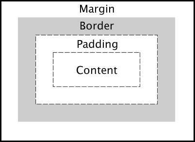

# Q : 박스 모델에 대한 이해를 설명하고, CSS에서 레이아웃을 다른 박스 모델로 렌더링하도록 브라우저에 지시하는 방법을 설명해주세요.

<br />

# A : 웹 페이지 상의 모든 `HTML` 요소는 박스모델로 표현됩니다

- 박스 모델은 웹페이지 레이아웃을 구성하는 기본적인 단위입니다.
  - 이를 통해 각 요소의 크기와 공간을 결정하는데 사용됩니다.

### 박스 모델은 크게 네부분으로 나뉩니다.

1. 콘텐츠

- 텍스트, 이미지 또는 다른 요소들이 실제로 표시되는 영역입니다.

2. 패딩

- 콘텐츠와 테두리 사이의 내부 공간입니다.
- 배경색과 배경이미지는 패딩 영역까지 적용됩니다.

3. 테두리

- 패딩의 바깥쪽을 감싸는 선입니다.
- `border`의 두께, 스타일, 색상등을 지정할 수 있습니다.

4. 마진

- 박스와 인접한 다르박스와의 외부 공간입니다.
- 마진은 배경색이나 이미지가 없는 투명한 영역입니다.



<br />

### CSS에서는 `box-sizing` 속성을 통해, 브라우저에게 요소의 박스 모델을 어떻게 렌더링할 것인지를 적용할 수 있습니다.

- 기본적으로 `CSS`의 박스 모델은 `content-box`로 설정되며, 이는 너비와 높이가 콘텐츠 영역만을 포함한다는것을 의미합니다.

  - 이를통해, 패딩과 보더는 콘텐츠 영역 외부에 추가됩니다.

  ```css
  .box {
    box-sizing: content-box;
    width: 100px;
    padding: 10px;
    border: 5px solid black;
    /* 실제 박스의 너비는 100 + 20(양쪽 패딩) + 10(양쪽 테두리) = 130px */
  }
  ```

- 반면 `border-box` 속성은 너비와 높이가 패딩과 보더를 포함하도록 설정할 수 있습니다.
  - 이는 요소의 최종 크기를 더 쉽게 계산할 수 있게해주며, 레이아웃을 다룰 때 더욱 직관적입니다.

```css
.box {
  box-sizing: border-box;
  width: 100px;
  padding: 10px;
  border: 5px solid black;
  /* 실제 박스의 너비는 100px (패딩과 테두리 포함) */
}
```
